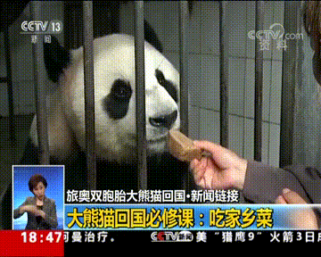
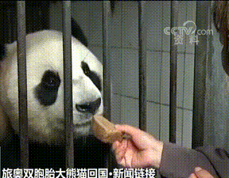

# How to make a dataset

Below is an example of our origin dataset（720*576）:



## 1: video

We will crop the main sight of the origin video out as a new set called "video" (576*450):

```bash
ffmpeg -i in.avi -vf crop=576:450:144:0 out.avi # crop=width:height:x:y
# Also you can use crop.py
```

We got this:



However, we will extract c3d feats, which require the videos to have same length,
 or we say, same frame nums. You can use `resample.py` along with `frames_count.py` to do this:

```bash
python3 dataset/frames_count.py --video_dir path/to/videos
# You will get the statistics characteristics of your videos' frame number.
# According them you can determine the 'target_frame' for resample.py.
# We recommend to set the target_frame to median frame num
python3 dataset/resample.py --video_dir path/to/videos --target_frame 224
```

## 2: sound

We extract the sound of the videos by ffmpeg.

## 3: hand
We will crop the sign language part out as a new set called "hand" (144*114): 

```bash
ffmpeg -i in.avi -vf crop=114:144:30:372 out.avi # crop=width:height:x:y
```

Then we get a "hand" video like this:

